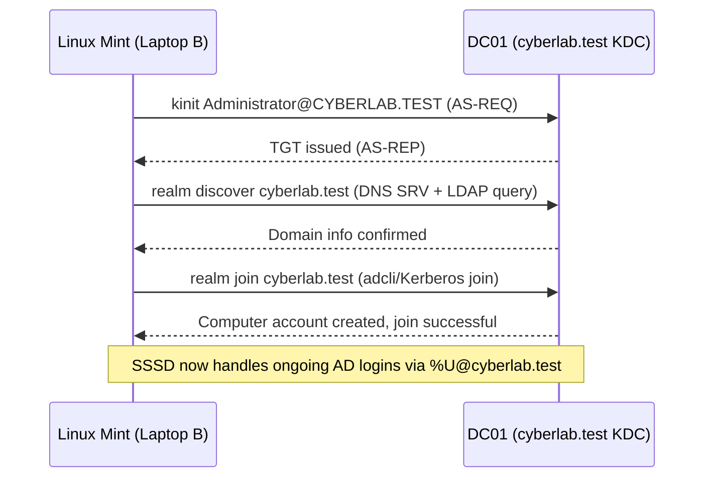
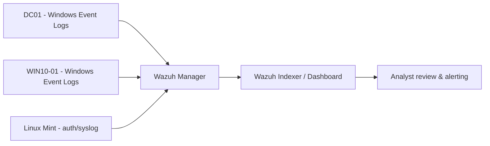

# CyberLab — Cybersecurity Home Lab Documentation

**Domain:** `cyberlab.test` | **Kerberos Realm:** `CYBERLAB.TEST`
**Status:** Active build — Active Directory operational, Wazuh SIEM 
**In Progress:** - Attack Simualtions & Fitgap Analysis

---

## 1. Executive Summary

CyberLab is a personal cybersecurity home lab built to develop and demonstrate hands-on skills in Windows Server administration, Active Directory, Linux/AD integration, and security monitoring (SIEM). The lab runs on a single VMware Workstation 17 host and combines a virtualized Windows Server 2025 domain controller with a physical Linux Mint machine acting as both an AD-integrated client and an administration/testing workstation. A Wazuh SIEM deployment is in progress to add centralized log collection and detection capability across the lab.

As of this documentation, Active Directory Domain Services, DNS, and Kerberos authentication are confirmed working, and the Linux Mint machine is successfully domain-joined via SSSD/realmd. The Wazuh manager has internet connectivity confirmed and agent enrollment has been completed for the Linux Mint host after resolving a series of networking issues (detailed in Section 31). A Windows 10 client VM (`WIN10-01`) exists in the environment and is registered as a Wazuh agent, though currently disconnected.

## 2. Project Objectives

- Build a self-contained, isolated lab environment for practicing Active Directory administration
- Stand up a working Windows domain (`cyberlab.test`) with DNS and Kerberos authentication
- Integrate a Linux client into the AD domain using industry-standard tooling (`realmd`, `SSSD`, Kerberos)
- Deploy a SIEM (Wazuh) to collect and monitor logs from lab systems
- Produce professional documentation suitable for a cybersecurity portfolio and job applications

## 3. Learning Objectives

- Practical experience with VMware virtual networking (host-only vs. NAT)
- Windows Server 2025 installation, static IP/DNS configuration, and AD DS deployment
- Linux-to-AD integration via Kerberos and SSSD
- Diagnosing and resolving real-world network routing and NAT issues
- SIEM deployment and agent enrollment troubleshooting
- Structured incident/problem documentation (symptom → cause → fix → verification)

## 4. Lab Architecture

```
                    ┌───────────────────────────────────────────┐
                    │        Home LAN / Wi-Fi (192.168.178.0/24) │
                    │              Gateway: 192.168.178.1        │
                    └───────────────┬─────────────────┬──────────┘
                                    │                 │
                     192.168.178.27 │                 │ 192.168.178.35
                    ┌───────────────▼─────┐   ┌────────▼──────────────┐
                    │   Laptop A (Host)    │   │   Laptop B             │
                    │   Windows Home       │   │   Linux Mint Cinnamon  │
                    │   i5 9th-gen, 16GB   │   │   (physical machine)   │
                    │   VMware Workstation │   │   AD-integrated client │
                    │   17                 │   │   + admin/test box     │
                    └───────────┬──────────┘   └─────────────────────────┘
                                │
              ┌─────────────────┴─────────────────┐
              │                                     │
     VMnet1 (Host-only)                    VMnet8 (NAT)
     10.10.10.0/24                          192.168.61.0/24
              │                                     │
   ┌──────────▼──────────┐          ┌────────────────▼────────────────┐
   │  DC01                │          │  Wazuh Manager (dual-homed)      │
   │  10.10.10.10/24      │          │  ens33: 10.10.10.20 (VMnet1)     │
   │  Windows Server 2025 │◄────────►│  ens37: 192.168.61.132 (VMnet8)  │
   │  AD DS + DNS         │  10.10.10.0/24  → used for Internet + agent │
   │  cyberlab.test       │                enrollment from Laptop B     │
   └──────────────────────┘          └───────────────────────────────────┘

   Other known VMs (VMware Library): Windows Server 2025, WazuhServer,
   WIN10-01 (Windows 10 client — registered as Wazuh agent, currently
   disconnected), Cloudera-Training (unrelated).
```

## 5. Network Topology

| Segment | CIDR | VMware Network | Purpose |
|---|---|---|---|
| Home LAN | 192.168.178.0/24 | — (physical Wi-Fi) | Connects both laptops to the home router |
| AD Lab Network | 10.10.10.0/24 | VMnet1 (Host-only) | Isolated network for DC01 and the Wazuh manager's internal interface |
| VMware NAT | 192.168.61.0/24 | VMnet8 (NAT, DHCP enabled) | Gives the Wazuh manager internet access and exposes it to the LAN via host port-forwarding |

**Key routing note:** Traffic destined for `10.10.10.0/24` from Laptop B must route through Laptop A (`192.168.178.27`), not the home router (`192.168.178.1`). This was a recurring source of connectivity failures — see Section 31, Problem 1.

```
Home LAN (192.168.178.0/24)
│
├── Laptop A / VMware host — 192.168.178.27
│   │
│   ├── VMnet1 (10.10.10.0/24)
│   │   ├── DC01        — 10.10.10.10  (cyberlab.test, AD DS + DNS)
│   │   └── Wazuh ens33  — 10.10.10.20  (internal AD-lab interface)
│   │
│   └── VMnet8 (192.168.61.0/24, NAT)
│       └── Wazuh ens37  — 192.168.61.132  (Internet + host port-forward
│                                            for agent enrollment)
│
└── Laptop B / Linux Mint — 192.168.178.35 (wlp2s0)
    Route: 10.10.10.0/24 via 192.168.178.27 dev wlp2s0
```

## 6. Hardware Specifications

| Machine | Role | CPU | RAM | Notes |
|---|---|---|---|---|
| Laptop A | VMware host | Intel Core i5 9th-gen | 16 GB | Windows Home, VMware Workstation 17 |
| Laptop B | Physical Linux Mint machine | Intel Core i5 8th/9th-gen `[NEEDS VERIFICATION — generation stated inconsistently across notes]` | 8 GB | Linux Mint Cinnamon; AD-integrated client + admin/test box |

Storage capacity/type for both machines: `[NEEDS VERIFICATION]`

## 7. Virtual Machine Specifications

| VM | OS | vCPU | RAM | Disk | Network Adapter |
|---|---|---|---|---|---|
| DC01 (Windows Server 2025) | Windows Server 2025 | 4 | 2 GB | 60 GB (NVMe) | Custom (VMnet1) |
| Wazuh Manager (`WazuhServer`) | Ubuntu (Wazuh 4.11.2) | `[NEEDS VERIFICATION]` | `[NEEDS VERIFICATION]` | `[NEEDS VERIFICATION]` | Dual-homed: VMnet1 (ens33) + VMnet8 NAT (ens37) |
| WIN10-01 | Windows 10 (implied by name) | `[NEEDS VERIFICATION]` | `[NEEDS VERIFICATION]` | `[NEEDS VERIFICATION]` | `[NEEDS VERIFICATION]` |
| Cloudera-Training | Unrelated to CyberLab project | — | — | — | — |

DC01's specs were confirmed directly from the VMware Workstation VM summary panel (2 GB memory, 4 processors, 60 GB NVMe disk, Network Adapter set to Custom/VMnet1).

## 8. Network Addressing Table

| Host | IP Address | Subnet | Gateway | DNS | Hostname / FQDN |
|---|---|---|---|---|---|
| Laptop A (host) | 192.168.178.27 | 192.168.178.0/24 | 192.168.178.1 | — | — |
| Laptop B (Linux Mint) | 192.168.178.35 | 192.168.178.0/24 | 192.168.178.1 (default) / 10.10.10.0/24 routed via 192.168.178.27 | — | — |
| DC01 | 10.10.10.10 | 10.10.10.0/24 | 10.10.10.1 | 127.0.0.1 / ::1 | `dc01.cyberlab.test` |
| Wazuh (internal) | 10.10.10.20 | 10.10.10.0/24 | 10.10.10.1 | 10.10.10.10 | `wazuh` |
| Wazuh (NAT) | 192.168.61.132 | 192.168.61.0/24 | 192.168.61.2 (DHCP) | — | — |
| WIN10-01 | `[NEEDS VERIFICATION]` | — | — | — | — |

## 9. VMware Configuration

| Network | Type | Host Connection | DHCP | Subnet |
|---|---|---|---|---|
| VMnet1 | Host-only | Connected | Disabled | 10.10.10.0/24 |
| VMnet8 | NAT | Connected | Enabled | 192.168.61.0/24 |

**Purpose:** VMnet1 isolates the AD lab from the internet and the home LAN, simulating a private enterprise network. VMnet8 gives the Wazuh manager (and only the Wazuh manager, via a second adapter) outbound internet access for package updates, while a host-level port-forward on VMnet8 exposes Wazuh's agent-communication ports (1514/1515) so the physical Linux Mint machine can reach the manager.

**Security relevance:** Segmenting the domain controller onto an isolated host-only network reduces its attack surface — it has no direct path to the internet. **Risk:** the Wazuh manager, by having a NAT-connected interface, is a potential bridge between the isolated AD segment and the internet if not carefully firewalled. **Improvement:** consider host-based firewall rules on the Wazuh VM restricting forwarding between its two interfaces.

## 10–16. Windows Server 2025 Installation, DC01 Configuration, Static IP, DNS, AD Installation, DC Promotion, Domain Configuration

**Confirmed facts:**
- Domain: `cyberlab.test`
- Kerberos realm: `CYBERLAB.TEST`
- Domain controller: `DC01` (`dc01.cyberlab.test`)
- DC01 static IPv4: `10.10.10.10/24`, gateway `10.10.10.1`, DNS `127.0.0.1` / `::1` (self-hosted DNS, standard practice for a DC)
- Verified via `ipconfig /all` on DC01 (screenshot): Host Name `DC01`, Primary DNS Suffix `cyberlab.test`, DHCP disabled (static config confirmed), DNS Suffix Search List `cyberlab.test`

**DNS verification performed:**
```
SRV record confirmed:
_ldap._tcp.dc._msdcs.cyberlab.test  → dc01.cyberlab.test, port 389
dc01.cyberlab.test                  → 10.10.10.10
```
This confirms AD DS has correctly registered its LDAP service location record and that forward DNS resolution for the DC works — both required for domain clients (including the Linux Mint machine) to locate the domain controller.

**`dcdiag /test:dns` results:**
- Primary DNS test: **reported a failure** `[NEEDS VERIFICATION — specific failing sub-test/error not documented]`
- Enterprise DNS test: **passed**
- Required AD DNS records: resolving correctly

**Not currently documented** (do not invent): exact `Install-WindowsFeature`/`Install-ADDSForest` command-line parameters used, forest/domain functional levels, DSRM password, organizational unit names, users/groups, GPOs configured.

> **Recommendation:** Capture the exact PowerShell commands used for AD DS installation and promotion (e.g. `Install-WindowsFeature AD-Domain-Services -IncludeManagementTools`, `Install-ADDSForest -DomainName "cyberlab.test" ...`) next time they're run, or re-run `Get-ADForest` / `Get-ADDomain` and record the functional levels for future documentation.

## 17. Organizational Units

Not currently documented. `[NEEDS VERIFICATION]`

## 18. Users and Groups

Not currently documented. When documented, use role-based descriptions only (e.g. `svc-wazuh`, `IT-Admins`) rather than real personal information.

## 19. Group Policy Configuration

Not currently documented. `[NEEDS VERIFICATION]`

## 20–21. Windows Client Configuration & Domain Joining

A Windows client VM, `WIN10-01`, exists in the VMware library and is registered in Wazuh's agent list (Agent ID `001`, IP: `any`), confirming it was built and at some point communicated with the Wazuh manager — though it currently shows as **Disconnected**.

**Not currently documented:** exact Windows version/build, VM specs, domain-join procedure/commands, or whether `WIN10-01` has actually been joined to `cyberlab.test`. `[NEEDS VERIFICATION]`

## 22. Linux Mint Configuration

**Role:** AD-integrated Linux client, primary administration/testing machine, and (potentially) a future security-testing box within the isolated lab network.

**Packages installed for AD integration:**
```
realmd
sssd
sssd-ad
sssd-tools
adcli
samba-common-bin
oddjob
oddjob-mkhomedir
packagekit
krb5-user
```
These packages together provide: domain discovery and enrollment (`realmd`, `adcli`), the identity/authentication back-end that talks to AD over LDAP/Kerberos (`sssd`, `sssd-ad`, `sssd-tools`), Kerberos ticket support (`krb5-user`), SMB/AD protocol compatibility (`samba-common-bin`), and automatic home-directory creation on first login (`oddjob-mkhomedir`).

## 23. Active Directory / Linux Integration

**Kerberos authentication test:**
```bash
kinit Administrator@CYBERLAB.TEST
```
*Purpose:* requests a Kerberos Ticket Granting Ticket (TGT) for the domain Administrator account, proving that the Linux machine can reach the DC's Kerberos KDC and that the realm/credentials are valid.
*Result:* **Successful.**

**Domain discovery:**
```bash
realm discover cyberlab.test
```
*Purpose:* queries DNS SRV records and LDAP to confirm the domain is reachable and to auto-detect the correct join parameters.
*Result:* **Successful.**

**Domain join:**
```bash
realm join cyberlab.test
```
*Purpose:* joins the Linux machine to the `cyberlab.test` AD domain, creating a computer account in AD and configuring SSSD locally.
*Result:* **Successful.**

**Post-join verification (`realm list`):** confirmed the machine is configured as a `kerberos-member` with SSSD integration, using login format `%U@cyberlab.test`.

### Authentication Flow (Kerberos)



**Security relevance:** successful `kinit` and domain join confirm correct DNS SRV records, correct system clock sync (Kerberos is time-sensitive), and correct realm/domain trust configuration — all foundational AD health checks.

## 24. Security Controls

Documented security-relevant configuration to date:
- Network segmentation of the domain controller onto an isolated VMnet (Section 9)
- DNS self-hosted on the DC, standard AD hardening practice
- Kerberos-based authentication for the Linux client (rather than NTLM or plaintext LDAP bind)

Not yet documented: password policy, account lockout policy, GPO-based hardening, firewall rules on DC01/WIN10-01. `[NEEDS VERIFICATION]`

## 25. Windows Event Logging

Not currently documented — no Windows Event Log review or forwarding configuration has been recorded yet. `[NEEDS VERIFICATION]`

## 26–27. Network Discovery, Enumeration & Security Testing Performed

**Confirmed activity to date (all performed against systems owned/controlled within this isolated lab):**

| Test | Command | Target | Result |
|---|---|---|---|
| DC connectivity | `ping -c 4 10.10.10.10` | DC01 | Confirmed reachable |
| DNS resolution | `nslookup dc01.cyberlab.test 10.10.10.10` | DC01 DNS | Confirmed correct |
| DC connectivity by name | `ping -c 4 dc01.cyberlab.test` | DC01 | Confirmed reachable |
| Gateway connectivity | `ping -c 4 10.10.10.1` | VMnet1 gateway | Confirmed reachable |
| Internet connectivity | `ping -c 4 8.8.8.8` | Google DNS | Confirmed (after Problem 4 fix) |
| Internet/package repo | `ping -c 4 archive.ubuntu.com` | Ubuntu repos | Confirmed reachable |
| Kerberos auth | `kinit Administrator@CYBERLAB.TEST` | DC01 KDC | Success |
| AD domain discovery | `realm discover cyberlab.test` | DC01 | Success |
| AD domain join | `realm join cyberlab.test` | DC01 | Success |

**Explicitly NOT yet performed (do not infer or invent results):**
Nmap scans, SMB enumeration, LDAP enumeration beyond DNS/Kerberos checks, Kerberos attack techniques (e.g. Kerberoasting), BloodHound/SharpHound collection, password attacks, privilege escalation, or exploitation of any kind.

All testing to date has been diagnostic/connectivity-focused rather than adversarial, and was performed exclusively against systems within this self-owned, isolated lab network.

## 28–29. Detection and Investigation Exercises / Incident Investigation Examples

No completed Wazuh detection or log-review exercise has been documented yet. This is planned future work once agent enrollment is finalized across all lab hosts (see Section 34).

### Planned Security Monitoring Flow



## 30–31. Problems Encountered & Troubleshooting Performed

### Problem 1 — Linux Mint could not reach the AD subnet
- **Symptom:** Linux Mint could not communicate with `10.10.10.0/24` (DC01, Wazuh internal interface).
- **Possible cause:** Default routing sent `10.10.10.0/24` traffic toward the home router (`192.168.178.1`) instead of the VMware host.
- **Investigation:** Reviewed the routing table; confirmed traffic to `10.10.10.10` was taking the path via `192.168.178.1`, which has no route to the isolated VMnet1 segment.
- **Solution:**
  ```bash
  sudo ip route replace 10.10.10.0/24 via 192.168.178.27 dev wlp2s0
  ```
- **Verification:** Linux Mint successfully reached DC01 and the AD lab subnet after the route change.
- **Lesson learned:** In a lab where a host-only VMware network isn't directly routable from the physical LAN, client machines need an explicit static route through the VMware host's LAN IP.

### Problem 2 — Linux AD DNS/routing (downstream of Problem 1)
- **Symptom:** Prior to the route fix, DNS resolution and Kerberos auth against the DC also failed.
- **Cause:** Same underlying routing issue as Problem 1.
- **Solution/Verification:** Once the route was corrected, `dc01.cyberlab.test` resolved correctly, AD SRV records worked, and Kerberos authentication succeeded.
- **Lesson learned:** Network-layer issues cascade upward — always verify basic IP reachability before troubleshooting DNS or authentication layers.

### Problem 3 — Linux domain integration
- **Symptom:** N/A — proactive configuration task.
- **Configuration performed:** Installed and configured `realmd`, `SSSD`, Kerberos client tools, `adcli`, and Samba common components.
- **Result:** Linux Mint successfully joined `cyberlab.test`.
- **Lesson learned:** `realmd` abstracts most of the manual SSSD/Kerberos configuration that would otherwise be needed for AD integration, significantly simplifying the join process once network/DNS prerequisites are met.

### Problem 4 — Wazuh VM had no internet access
- **Symptom:** Wazuh VM (`10.10.10.20/24`, gateway `10.10.10.1`, DNS `10.10.10.10`) could reach DC01 and the gateway, but `ping 8.8.8.8` failed and `apt update` could not reach Ubuntu repositories.
- **Possible cause:** The VM's only network adapter was on the isolated VMnet1, which has no route to the internet by design.
- **Investigation:** Confirmed internal connectivity worked but all external connectivity failed — pointed to a missing egress path rather than a DNS or firewall issue.
- **Solution:** Added a second VMware network adapter on VMnet8 (NAT) alongside the existing VMnet1 adapter, giving the Wazuh VM a dual-homed configuration: VMnet1 for AD-lab communication, VMnet8/NAT for internet access.
- **Verification:** `ping archive.ubuntu.com` succeeded after the change.
- **Lesson learned:** Isolating a host on a private network for security also isolates it from needed services (e.g. package updates); a deliberate, minimal second interface is a reasonable trade-off when internet access is required for that one host.

### Problem 5 — `systemctl` initially appeared unavailable
- **Symptom:** `sudo systemctl status wazuh-manager` returned `sudo: systemctl: command not found`.
- **Possible cause:** Suspected systemd was missing entirely.
- **Investigation:** `which systemctl` returned `/usr/bin/systemctl`, showing the binary existed.
- **Solution:** Ran the command with the full path: `sudo /usr/bin/systemctl status wazuh-manager`.
- **Verification:** Command executed successfully.
- **Lesson learned:** The issue was `$PATH` resolution under `sudo`, not a missing service manager — worth checking `which`/`command -v` before assuming a deeper problem.

### Problem 6 — Old Wazuh installation would not uninstall cleanly
- **Symptom:** Uninstalling the previous Wazuh 4.11.2 installation left `wazuh-manager`, `wazuh-indexer`, and `filebeat` unable to be removed; the dashboard package entered a broken/reinstallation-required state.
- **Investigation:** Attempted the standard uninstall script, which failed to fully remove the listed packages.
- **Solution:** Proceeded to manual `dpkg`-level cleanup (see Problem 7).
- **Lesson learned:** SIEM stack uninstalls with many interdependent packages (indexer, manager, dashboard, filebeat) can leave partial state; a full manual `dpkg` cleanup pass is sometimes necessary before a clean reinstall.

### Problem 7 — `dpkg` was interrupted
- **Symptom:** APT reported `dpkg was interrupted; manually run sudo dpkg --configure -a`.
- **Investigation:** Running the suggested repair command revealed the broken `wazuh-dashboard` package needed reinstallation, but its package archive was no longer available (already removed from the repo/cache).
- **Solution:**
  ```bash
  sudo dpkg --remove --force-remove-reinstreq wazuh-dashboard
  ```
- **Result:** `wazuh-dashboard` was force-removed; `filebeat`, `wazuh-indexer`, and `wazuh-manager` remained to be cleaned up as of this documentation.
- **Lesson learned:** `--force-remove-reinstreq` is a useful (if blunt) recovery tool when a package's archive is unavailable and it's blocking further `dpkg` operations — use cautiously, and only when a clean reinstall is the intended next step.

### Problem 8 — Wazuh agent stuck in "pending" despite raw port connectivity succeeding
- **Symptom:** A newly enrolled Wazuh agent (Linux Mint / `LI-MINT01`) remained in `pending` status indefinitely. `nc -zv` tests against the manager's LAN-facing IP (`192.168.178.27`) on both port 1514 and 1515 reported success, yet the agent log repeatedly showed:
  ```
  ERROR: SSL error (5). Connection refused by the manager. Maybe the port specified is incorrect.
  ```
- **Possible cause:** Initial suspicion was a wrong manager IP in `ossec.conf` (agent was pointed at the manager's internal NAT IP, `192.168.61.132`, which is unreachable from the LAN).
- **Investigation:** Corrected `ossec.conf` to use the LAN-facing IP (`192.168.178.27`), which resolved the *initial* enrollment target. However, enrollment still failed with the same SSL error, pointing to a deeper NAT-layer issue.
- **Further investigation:** Inspecting VMware's NAT port-forwarding table revealed the rule for port 1515 forwarded to a typo'd, nonexistent internal address (`198.168.61.132` instead of `192.168.61.132`). Raw TCP tests still "succeeded" because VMware's NAT layer accepted the initial connection before attempting (and failing) to hand it off internally.
- **Solution:** Corrected the port-forwarding rule for 1515 to point to `192.168.61.132` (matching the 1514 rule).
- **Verification:** Re-tested, but see Problem 9 — a second, independent issue was still blocking full connectivity at this point.
- **Lesson learned:** A successful low-level `nc`/TCP port check does not guarantee the application-layer service on the other end actually receives the traffic when NAT/port-forwarding is involved — always verify configuration values (like forwarded IPs) directly, not just reachability.

### Problem 9 — Asymmetric routing on the Wazuh manager VM silently dropped all reply traffic
- **Symptom:** Even after fixing Problem 8, the agent still could not complete a TCP handshake with the manager on port 1514; `tcpdump` on the manager showed inbound SYN packets arriving correctly on `ens37` (the NAT interface), but outbound SYN-ACK replies leaving via `ens33` (the host-only interface) instead — an endless retransmission loop with no completed handshake.
- **Possible cause:** The manager VM has two network interfaces (`ens33` on the isolated `10.10.10.0/24` VMnet1, `ens37` on the NAT `192.168.61.0/24` VMnet8) and two competing default routes.
- **Investigation:** `ip route` showed a static default route via `10.10.10.1 dev ens33` with no explicit metric (effectively priority 0), which outranked the correct DHCP-assigned default route via `192.168.61.2 dev ens37 metric 100`. Any reply to an unrecognized external destination (like the agent's LAN IP) was therefore routed out the wrong, isolated interface and lost.
- **Solution:**
  ```bash
  sudo ip route del default via 10.10.10.1 dev ens33
  ```
  This left only the correct `ens37` default route in place.
- **Verification:** Re-running `tcpdump` during a fresh agent connection attempt showed a completed SYN / SYN-ACK / ACK handshake; the agent's state file subsequently showed `status='connected'` with populated `last_keepalive`/`last_ack` timestamps.
- **Lesson learned:** On a dual-homed VM, an unintended low-metric (or metric-less) default route on the "wrong" interface can silently break connectivity in a way that looks identical to a firewall or NAT problem from the outside — packet captures on the receiving host, checking for asymmetric in/out interfaces, are the fastest way to diagnose this class of issue. **Follow-up required:** this route deletion is not persistent across reboot; the fix still needs to be made permanent via Netplan (removing the static route/gateway on `ens33`).

### Problem 10 — Wazuh key enrollment via network remained unreliable; manual key exchange used as a workaround
- **Symptom:** Even with routing and NAT corrected, automated enrollment over port 1515 had proven fragile through multiple layers of misconfiguration.
- **Solution:** Generated the agent key manually on the manager via `manage_agents` (Add agent → Extract key), then imported that key directly on the Linux Mint agent via `manage_agents -I`, bypassing the network enrollment (port 1515) step entirely while still relying on the already-working port 1514 for ongoing agent-manager communication.
- **Verification:** `client.keys` populated correctly on the agent; agent reached `connected` status immediately after restart.
- **Lesson learned:** For a small/lab-scale deployment, manual key exchange is a reliable fallback that sidesteps enrollment-specific networking issues (NAT, routing, TLS-layer refusals) entirely, at the cost of not scaling to larger automated deployments.

## 32. Lessons Learned

- Isolated lab networks (VMware host-only) require explicit static routes on any physical machine that needs to reach them from outside the host — this is not automatic.
- Low-level connectivity checks (`nc`, `ping`) can give a false sense of confidence when NAT or port-forwarding is in the path; always verify the actual configured target addresses.
- Dual-homed VMs are a common source of asymmetric routing bugs; a stray default route with a lower (or default) metric can silently swallow return traffic and produce symptoms that look like a firewall issue.
- Kerberos and AD-integration failures are frequently downstream symptoms of basic IP routing or DNS problems — troubleshoot from the network layer up.
- Manual/offline key exchange is a practical fallback for SIEM agent enrollment when network-based auto-enrollment proves unreliable in a NAT'd lab environment.
- Package-manager-level cleanup (`dpkg --force-remove-reinstreq`, `dpkg --configure -a`) is sometimes necessary to recover from a partially failed service uninstall/reinstall.

## 33. Security Improvements

- Corrected NAT port-forwarding typo (Problem 8) that could have left port 1515 exposed/misrouted indefinitely if unnoticed.
- Removed the conflicting default route (Problem 9), restoring intended network segmentation behavior for the Wazuh manager's two interfaces.
- Confirmed Kerberos-based authentication is functioning correctly for the Linux client, rather than falling back to weaker authentication methods.

## 34. Future Improvements

- Persist the routing fix from Problem 9 via Netplan so it survives VM reboot.
- Complete the Wazuh reinstall/cleanup (`filebeat`, `wazuh-indexer`, `wazuh-manager` packages still pending removal as of Problem 6/7).
- Enroll `WIN10-01` and DC01 as Wazuh agents; investigate why `WIN10-01` currently shows "Disconnected".
- Document AD OUs, users/groups (by role), and GPOs once configured.
- Document exact `Install-ADDSForest` parameters and forest/domain functional levels.
- Begin planned detection exercises once all agents are connected (Section 28–29 flow).
- Consider host-based firewall rules on the Wazuh manager restricting traffic between its two interfaces to reduce bridging risk between the isolated AD network and the internet-facing NAT interface.

## 35. Cybersecurity Skills Demonstrated

- VMware Workstation virtualization and virtual networking (host-only vs. NAT design)
- Windows Server 2025 administration
- Active Directory Domain Services deployment
- DNS configuration and SRV-record verification for AD
- Linux system administration (Linux Mint / Debian-based package management)
- Linux-to-Active-Directory integration (`realmd`, `SSSD`, `adcli`, Kerberos)
- Kerberos authentication concepts and practical use (`kinit`, ticket-granting)
- Network troubleshooting: static routing, asymmetric routing diagnosis via packet capture (`tcpdump`)
- NAT/port-forwarding configuration and debugging
- SIEM deployment (Wazuh) and agent enrollment troubleshooting
- Structured technical problem documentation and incident write-ups

## 36. Final Architecture (Current State)

```
HOME NETWORK (192.168.178.0/24)
│
├── Laptop A — Windows host (192.168.178.27)
│   VMware Workstation 17
│   │
│   ├── VMnet1 (10.10.10.0/24, host-only)
│   │   ├── DC01          10.10.10.10   cyberlab.test | AD DS + DNS ✅
│   │   └── Wazuh (ens33)  10.10.10.20   internal interface ✅
│   │
│   ├── VMnet8 (192.168.61.0/24, NAT)
│   │   └── Wazuh (ens37)  192.168.61.132  Internet + agent enrollment ✅
│   │       (port-forward 1514/1515 → host 192.168.178.27)
│   │
│   └── WIN10-01 (Windows 10 client) — Wazuh Agent ID 001, Connected ✅
│
└── Laptop B — Linux Mint (192.168.178.35)
    AD-joined via realmd/SSSD/Kerberos ✅
    Wazuh Agent (LI-MINT01) — Connected ✅
    Route: 10.10.10.0/24 via 192.168.178.27
```

## 37. Conclusion

CyberLab has established a working foundation: an isolated Active Directory domain with functioning DNS and Kerberos authentication, a Linux client fully integrated into that domain, and a Wazuh SIEM manager with confirmed internet access and at least one connected agent after resolving a genuinely instructive chain of NAT and routing issues. The next phase of work is completing the Wazuh reinstall, enrolling the remaining hosts (`DC01`, `WIN10-01`), and layering in documented AD structure (OUs, GPOs, users/groups) and initial detection exercises — at which point the lab will support the full intended blue-team workflow: generate activity, collect logs centrally, and investigate.

---

# CyberLab

A self-built, isolated cybersecurity home lab combining Active Directory, Linux/AD integration, and Wazuh SIEM monitoring — built for hands-on practice and portfolio demonstration.

## Description

CyberLab runs on a single VMware Workstation 17 host and models a small enterprise network: an isolated Windows Server 2025 domain controller (`cyberlab.test`), a physical Linux Mint machine integrated into that domain via Kerberos/SSSD, and a Wazuh SIEM manager for centralized security monitoring.

## Objectives

- Deploy and administer a functioning Active Directory domain
- Integrate a Linux client into AD using industry-standard tooling
- Stand up a SIEM (Wazuh) for log collection and detection
- Diagnose and document real networking/NAT/routing issues as they arise

## Architecture

- **Laptop A** (VMware host): Windows Home, i5 9th-gen, 16 GB RAM — hosts DC01 and the Wazuh manager VM
- **Laptop B** (physical): Linux Mint Cinnamon, i5, 8 GB RAM — AD-integrated client and admin/test box
- **VMnet1** (10.10.10.0/24, host-only): isolated AD-lab segment
- **VMnet8** (192.168.61.0/24, NAT): internet access + agent enrollment path for the Wazuh manager

## Technologies

Windows Server 2025 · Active Directory Domain Services · DNS · Kerberos · Linux Mint · realmd/SSSD/adcli · Wazuh SIEM · VMware Workstation 17

## Lab Components

- `DC01` — Windows Server 2025 domain controller (AD DS + DNS)
- Linux Mint — AD-joined client / admin & testing machine
- Wazuh Manager — SIEM, dual-homed for internal lab + internet access
- `WIN10-01` — Windows 10 client (Wazuh agent registered, currently disconnected)

## Security Exercises

Connectivity, DNS, and Kerberos authentication verification across the domain; Wazuh agent enrollment and network diagnostics (NAT port-forwarding correction, asymmetric-routing diagnosis via `tcpdump`). No offensive-security testing has been performed yet — all activity to date has been defensive/diagnostic and confined to self-owned lab systems.

## Key Lessons Learned

- Host-only VMware networks need explicit routing from external machines
- Raw TCP reachability checks can mask deeper NAT/application-layer failures
- Dual-homed VMs are prone to asymmetric-routing bugs from competing default routes
- Manual key exchange is a solid fallback for SIEM agent enrollment in NAT'd environments

## Skills Demonstrated

VMware networking · Windows Server administration · Active Directory · DNS · Linux administration · Kerberos · SSSD/AD integration · Network troubleshooting (routing, NAT, packet capture) · SIEM deployment · Technical documentation

## Future Improvements

- Persist routing fix via Netplan
- Complete Wazuh reinstall and enroll remaining hosts
- Document OUs, GPOs, and users/groups
- Begin log-based detection exercises
